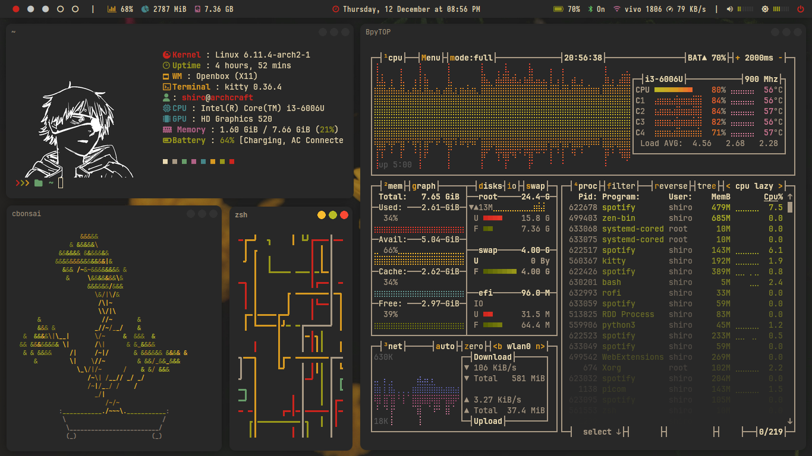
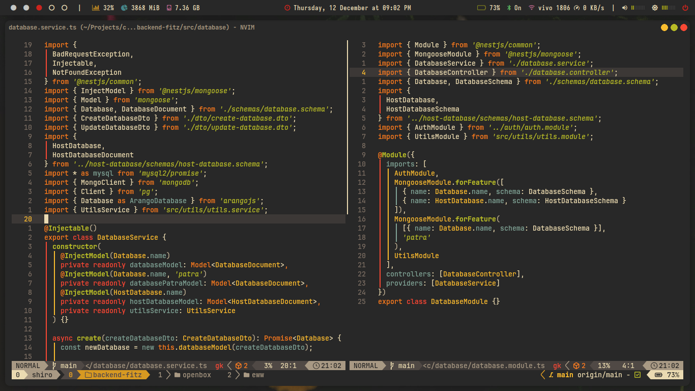
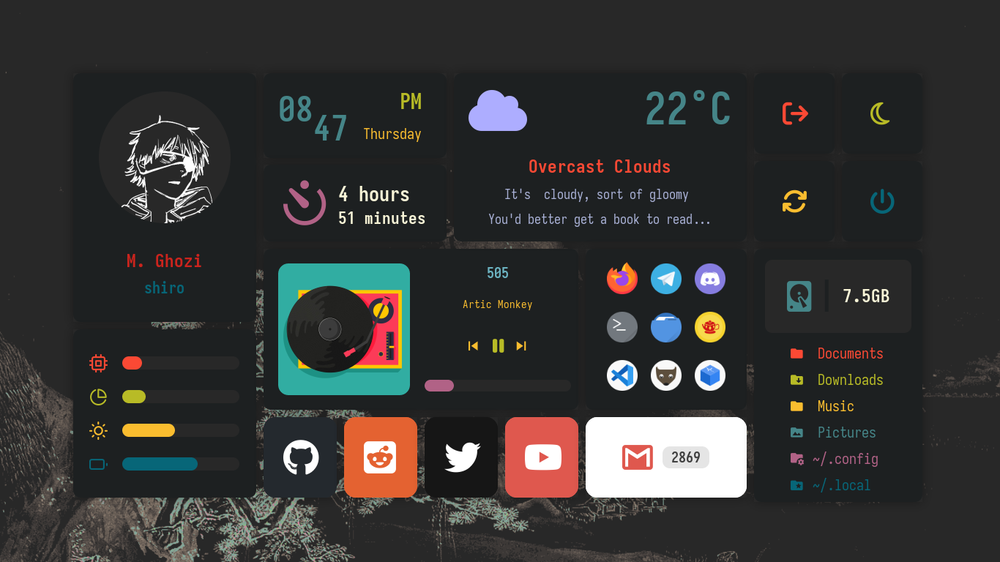

## Openbox Dotfiles
most of my configuration comes from Archcraft

## 🖼️ Showcase




## 🚀 Usage

Simply drag and drop my dotfiles into your ```.config/``` folder in your home, or copy these set of commands:

```
git clone https://github.com/m-ghozi/openbox-dotfiles.git
mv openbox-dotfiles/* ~/.config
mv openbox-dotfiles/themes/ ~/.themes
```

if you use archcraft
```
git clone https://github.com/m-ghozi/openbox-dotfiles.git
mv openbox-dotfiles/openbox/themes/gruvbox ~/.config/openbox/themes
mv openbox-dotfiles/themes/ ~/.themes
```

## 💾 Credits & Resources
- [Archcraft OS](https://github.com/archcraft-os) the GOAT ↕️↔️
- [Widget Config](https://github.com/adi1090x/widgets) by adi1090x

## 📃 FYI
- The widget is Made for 1366x768 displays only.
- Use adi1090x [Config](https://github.com/adi1090x/widgets) for 1920x1080 display.
